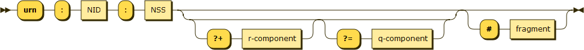

# Laravel Urn
Simple way to create urn identifiers for your laravel application, 
allowing a simple way to identifies resources or models a more descriptive
way.


#### Installation
Application can be installed by running:
```bash
composer require serendipias/laravel-urn
```
The application requires laravel/lumen >= 6.x

#### Usage
##### Register provider:

In Laravel __config/app.php__ add the urn service provider to your providers array:
```bash
\Serendipias\Urn\UrnServiceProvider::class,
```
if you are using Lumen you will need to register the service provider in your __bootstrap/app.php__
```php
$app->register(\Serendipias\Urn\UrnServiceProvider::class);
```

##### Publishing configuration:
Publish the configuration, run the following command:

```bash
php artisan vendor:publish --tag=urn
```
In lumen you will need to manually copy the urn file to your config directory.

The package has 3 basic configurations that are required to work with laravel/lumen models:
- models_namespace: Models namespace, this is use to be able to get models instances from the urn
- service: this is use to declare where the urn was created, which application is the source for the identifier
- stage: determinate if the resource was generated in production, testing, stage or unit testing.

##### Enable models to generate urns
To allow a model to be urn identifiable the model must extend `Serendipias\Urn\Contracts\UrnIdentifiable`
interface, the package provides a trait with the interface default implementations `UrnIdentifiableTrait`.

To generate urn with a model, inject or make `Serendipias\Urn\Services\UrnService::class`, from there you can 
encode a model, or decode an urn string, in both cases an `Serendipias\Urn\Support\Urn` is returned.

**Urn instance example:**
```bash
Serendipias\Urn\Support\Urn {
  -urn: "urn:laravel:local:user:1"
  -namespace: "App\Models"
  -parts: array:5 [
    0 => "urn"
    1 => "laravel"
    2 => "local"
    3 => "user"
    4 => "1"
  ]
}

```


**To encode an model:**

```php
$service = app(\Serendipias\Urn\Services\UrnService::class);
$urn = $service->encode(\App\Models\User::find(1));
$urn->getUrnString(); // urn:laravel:local:user:1
```

**To decode a urn string:**
```php
$service = app(\Serendipias\Urn\Services\UrnService::class);
$urn = $service->decode(\App\Models\User::find(1));
$urn->find(); // will return User model or null if not found
```
